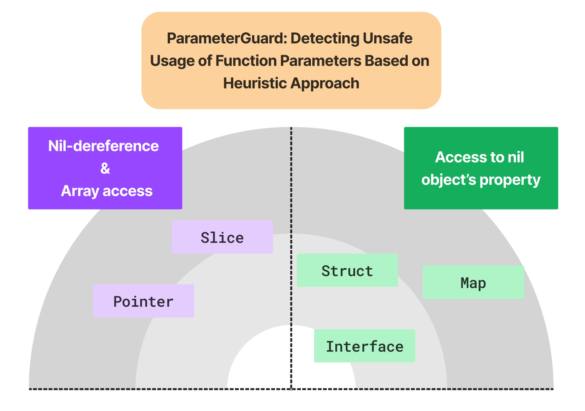

# ParameterGuard

There were specific linters in place designed for static analysis of certain properties within the codebase.
One of these was "errcheck," which focused on identifying the absence of error return checks, while another named "staticcheck" operated based on rule-based checks.
The impetus behind this project stemmed from an approach that prioritized preemptively handling errors in coding, akin to the meticulous error-handling practices observed in C programming.
This methodology aimed to mitigate issues like crashes due to unexpected interactions with NULL values.
Importantly, the existing, readily available linters didn't align with this core motivation.
Introducing the "ParameterGuard" checker sought to rectify this gap by delving into the realm of error-prone coding scenarios.
Its purpose was to proactively analyze and flag violations related to these error-prone coding patterns, ultimately reducing the necessity for extensive post-implementation testing.

For a simple example,
```go
func process(serialized []byte) {
    if serialized != nil { // Guard for `serialized`
        // Confirmed the `serialized` is not empty
    }
}
```
The same format with C language:
```C
void process(unsigned char* serialized) {
    if (serialized != NULL) {
        // Confirmed the `serialized` is not empty
    }
}
```
The guard serves the purpose of verifying that the parameter serialized isn't devoid of data, thus establishing a secure foundation for data manipulation.
In the absence of this protective measure, the code becomes susceptible to runtime error like panics.

### How to work
In essence, the ParameterGuard encompasses three predetermined guards (rules).
When parameter usages adhere to these established guards, their safety is assured.
However, instances where such guards are absent—occurring prior to the related usages—are inserted into a report list for subsequent review, which delegates the final comfirmation to the programmers.
`ParameterGuard` is implemented from scratch with 1K LoC in Golang, powered by Golang analysis pass pipeline.

### How to build
`cd cmd cd cmd/paramguard; go install` # method1: compile and copy the compiled binary to $GOPATH/bin
`cd cmd cd cmd/paramguard; go build` # method2: compile

### How to run
Simply, `./paramguard ./...` # all the reports to stdout

To make a report file, `paramguard --config=../exclude.yml ./... 2>&1 | tee -a report` # `report` file contains all the reported violations

### Flag
`--config=<configuration file path>` Set the configuration file path (default=none)

- Configuration file format
```yaml
files: ["*_test.go", "safe.go"] # Checker ignores all the test files and `safe.go`
pkgs: ["mypackage1", "mypackage2"] # Checker ignores entire functions under the `mypackage1` and `mypackage2`
funcs:
  [
    {
      pkg: "mypackage3",
      funcs: ["func1", "func2"] # Checker ignores `func1` and `func2` under the package `mypackage3`
    },
    {
      pkg: "mypackage4",
      funcs: ["func1", "func2"]
    }
  ]
log: false # Print skipped files if it is true
callgraph: true # Additionaly provide feasible callgraph paths for the reported violations
maxpath: 5 # Maximum path length of callgraph
```

### Interesting types
interface, map, pointer, slice, struct, function pointer
